# Complete Algorithm Flow — From Inputs to Mission Planner

This diagram covers the **full end-to-end flow** of the codebase as executed by `run_mission.py`:
Input Parameters → Mission Planner → Time-Step Loop → Auto-Trim → BEMT Solver → State Update → Outputs.

```mermaid
flowchart TD

    classDef input     fill:#1a3a5c,stroke:#4a9eff,color:#e0f0ff
    classDef process   fill:#1a2e1a,stroke:#4caf50,color:#e0ffe0
    classDef bemt      fill:#3a1c40,stroke:#cc66ff,color:#ffe6f9,stroke-width:2px
    classDef decision  fill:#3b2800,stroke:#ffaa00,color:#fff8e1
    classDef error     fill:#3a1010,stroke:#ff4444,color:#ffe0e0
    classDef output    fill:#103a20,stroke:#44ff88,color:#e0ffe0
    classDef label     fill:#111,stroke:#555,color:#aaa,font-style:italic

    %% ════════════════════════════════════════════
    %% STAGE 1 — INPUT PARAMETERS  (parameters.py)
    %% ════════════════════════════════════════════

    A0["━━  STAGE 1: Input Parameters  (parameters.py)  ━━"]:::label

    A1["Rotor Geometry<br/>Radius R, Num Blades B, root_cutout<br/>chord_fn(r/R), twist_fn(r/R)"]:::input
    A2["Airfoil Model<br/>LinearAirfoil: Cl=a₀α, Cd=Cd_min+ε·α²<br/>TableAirfoil: interpolated polar data"]:::input
    A3["Propulsion Models<br/>Engine Power Available (kW)<br/>Specific Fuel Consumption (kg/J)"]:::input
    A4["Mission Profile<br/>List of Segments: HOVER, VERTICAL_CLIMB,<br/>VERTICAL_DESCENT, CRUISE, LOITER"]:::input
    A5["Design Limits<br/>Max Tip Mach, Max Stall Fraction<br/>Min Power Margin, RPM & Collective bounds"]:::input

    A0 ~~~ A1 & A2 & A3 & A4 & A5

    %% ════════════════════════════════════════════
    %% STAGE 2 — INITIALIZATION  (run_mission.py)
    %% ════════════════════════════════════════════

    B0["━━  STAGE 2: Initialize MissionPlanner  (run_mission.py)  ━━"]:::label
    B1["Set Initial Aircraft State<br/>Gross Mass = Empty Mass + Payload + Fuel<br/>Fuel Mass = Fuel Mass"]:::process
    B2["Build MissionPlanner Object<br/>Attach: Rotor, Airfoil, Engine, Limits<br/>Attach: Live Plot Callback (optional)"]:::process
    B3["Parse Mission Profile<br/>Convert segment list → MissionSegment objects"]:::process

    A1 & A2 & A3 & A4 & A5 --> B0
    B0 --> B1 --> B2 --> B3

    %% ════════════════════════════════════════════
    %% STAGE 3 — MISSION LOOP  (mission.py)
    %% ════════════════════════════════════════════

    C0["━━  STAGE 3: Mission Segment Loop  (mission.py → run_mission)  ━━"]:::label
    C1{"More Segments\nin Mission Profile?"}:::decision
    C2["Load Next Segment\nRead: seg_type, altitude, RPM,\nduration, dt, cruise/climb speed"]:::process
    C3{"Segment Type?"}:::decision
    C4["PAYLOAD_EVENT:\nInstantly adjust gross_mass\n→ Skip to next segment"]:::process

    B3 --> C0 --> C1
    C1 -- "Yes" --> C2 --> C3
    C3 -- "PAYLOAD_EVENT" --> C4 --> C1

    %% ════════════════════════════════════════════
    %% STAGE 4 — TIME-STEP LOOP  (mission.py)
    %% ════════════════════════════════════════════

    D0["━━  STAGE 4: Time-Step Integration Loop  dt = 5s default  ━━"]:::label
    D1["Query ISA Atmosphere\nGet ρ, a_sound at segment altitude"]:::process
    D2["Determine v_axial\nHover/Loiter: 0\nClimb: +Vz,  Descent: −Vz\nCruise: TAS − wind"]:::process
    D3["Calculate Required Thrust (T_req)\nHover/Climb: T = gross_mass × g\nCruise: T = Parasite Drag + Induced Drag"]:::process

    C3 -- "HOVER / CLIMB\n/ CRUISE / LOITER" --> D0
    D0 --> D1 --> D2 --> D3

    %% ════════════════════════════════════════════
    %% STAGE 5 — AUTO-TRIM LOOP  (mission.py → _optimize_trim)
    %% ════════════════════════════════════════════

    E0["━━  STAGE 5: Auto-Trim  (mission.py → _optimize_trim)  ━━"]:::label
    E1["Check Thrust Feasibility\nEval residual at θ_min and θ_max\nIf same sign → infeasible"]:::process
    E2{"Feasible?"}:::decision
    E3["Outer Root Finder — Brent's Method\nSearch collective θ in [θ_min, θ_max]\nTarget: T_BEMT(θ) = T_req / num_rotors"]:::process
    E_fail["MissionInfeasibleError:\nCannot trim at this RPM & condition"]:::error

    D3 --> E0 --> E1 --> E2
    E2 -- "No" --> E_fail
    E2 -- "Yes" --> E3

    %% ════════════════════════════════════════════
    %% STAGE 6 — BEMT SOLVER  (bemt.py → run_bemt)
    %% ════════════════════════════════════════════

    F0["━━  STAGE 6: BEMT Solver  (bemt.py → run_bemt)  ━━"]:::label
    F1["Discretize Blade Span\nN=60 radial stations from root_cutout to R"]:::bemt
    F2["At each station r:\nLook up chord(r/R), twist(r/R), airfoil(r/R)\nCompute θ_total = twist + θ_collective"]:::bemt
    F3["Inner Root Finder — Brent's Method\nFind induced velocity v where:\ndT_BET(v) − dT_mom(v) = 0"]:::bemt
    F4["For each trial v:\n  U_T = Ω·r,   U_P = V_axial + v\n  φ = atan2(U_P, U_T)\n  α = θ_total − φ\n  Cl, Cd = airfoil.get_coeffs(α)\n  Apply Prandtl-Glauert if Mach < 0.7\n  F = Prandtl Tip-Loss factor\n  dT_BET = B·(dL·cosφ − dD·sinφ)\n  dT_mom = 4πrρF·|V_axial+v|·v"]:::bemt
    F5["Radial Integration  (trapezoidal rule)\nT = ∫dT/dr·dr,  Q = ∫dQ/dr·dr,  P = Q·Ω\nCT, CQ, CP, Figure of Merit / η"]:::bemt

    E3 -->|"Trial θ"| F0
    F0 --> F1 --> F2 --> F3 --> F4
    F4 -->|"Repeat for each station"| F3
    F3 -->|"Converged"| F5
    F5 -->|"T_BEMT, P_req"| E3

    %% ════════════════════════════════════════════
    %% STAGE 7 — LIMIT CHECKS & STATE UPDATE  (mission.py)
    %% ════════════════════════════════════════════

    G0["━━  STAGE 7: Limit Checks & State Update  (mission.py)  ━━"]:::label
    G1{"Check Design Limits\nTip Mach ≤ 0.85?\nStall Fraction ≤ 5%?\nPower Margin ≥ 5%?\nRPM & Collective in bounds?"}:::decision
    G2["Burn Fuel\nburn_rate = SFC × P_req\nfuel_mass -= burn_rate × dt\ngross_mass -= fuel_burned"]:::process
    G3{"Fuel above\nreserve?"}:::decision
    G4["Log Telemetry\ntime, fuel, mass, RPM, collective\nthrust, power, Mach, stall fraction"]:::process
    G5["Fire Live Plot Callback\n(updates real-time charts)"]:::process
    G_limit["MissionInfeasibleError:\nReport: segment name, time, reason"]:::error
    G_fuel["MissionInfeasibleError:\nFuel below reserve"]:::error

    E3 -->|"Converged θ & Perf"| G0
    G0 --> G1
    G1 -- "FAIL" --> G_limit
    G1 -- "PASS" --> G2 --> G3
    G3 -- "No" --> G_fuel
    G3 -- "Yes" --> G4 --> G5

    %% ════════════════════════════════════════════
    %% LOOP BACK & FINAL OUTPUTS
    %% ════════════════════════════════════════════

    H1{"More dt\nsteps in\nthis segment?"}:::decision
    H2["Save Final State\nFuel remaining, total time, full log"]:::output
    H3["Generate Output Plots  (run_mission.py)\nFuel burn timeline\nFlight phase tracker\nAuto-trimmed collective vs time"]:::output

    G5 --> H1
    H1 -- "Yes" --> D1
    H1 -- "No" --> C1
    C1 -- "No → Mission Complete" --> H2 --> H3
```

---

### Module Responsibility Map

| Module | Role |
|---|---|
| `parameters.py` | Single source of truth for all aircraft & mission config |
| `rotor.py` | Blade geometry container — chord, twist, tip speed functions |
| `airfoil.py` | Lift/drag models — Linear, Table-interpolated, Radially blended |
| `environment.py` | ISA atmosphere — density & speed of sound at altitude |
| `bemt.py` | Core BEMT solver — per-element induced velocity, radial integration |
| `mission.py` | Mission Planner — segment loop, auto-trim, fuel burn, limit checking |
| `run_mission.py` | Entry point — builds planner, runs mission, live plots |

### Key Facts About `mission.py` Usage

- ✅ **Actively used** — `run_mission.py` imports `MissionPlanner`, `MissionSegment`, `SegmentType`, `PowerAvailableModel`, `FuelModel`, `DesignLimits`, `MissionInfeasibleError` from `mission.py`
- ✅ **`_optimize_trim()`** is the outer Brent's method loop that finds the correct collective pitch at each time step
- ✅ **`run_segment()`** is the time-step integration engine that calls `_optimize_trim()` in a loop
- ✅ **`run_mission()`** is the top-level function called from `run_mission.py` that chains all segments together
