```mermaid
flowchart TD

    classDef input    fill:#1a3a5c,stroke:#4a9eff,color:#e0f0ff
    classDef step     fill:#1a2e1a,stroke:#4caf50,color:#e0ffe0
    classDef eq       fill:#2a1a3a,stroke:#cc66ff,color:#ffe6f9
    classDef decision fill:#3b2800,stroke:#ffaa00,color:#fff8e1
    classDef conv     fill:#103a20,stroke:#44ff88,color:#e0ffe0
    classDef fail     fill:#3a1010,stroke:#ff4444,color:#ffe0e0
    classDef integ    fill:#1a2a3a,stroke:#4ac8ff,color:#e0f8ff

    %% ──────────────────────────────────────────────────────────────────────
    %% INPUTS
    %% ──────────────────────────────────────────────────────────────────────

    IN1["Rotor Geometry\nRadius R, Num Blades B, root_cutout\nchord_fn(r/R),  twist_fn(r/R)"]:::input
    IN2["Operating Conditions\nΩ (rad/s), θ_collective (rad)\nV_axial (climb / cruise TAS)\nρ (density), a (speed of sound)"]:::input
    IN3["Airfoil Provider\nairfoil(r/R) → Cl, Cd, stall_flag\nLinearAirfoil or TableAirfoil"]:::input

    IN1 & IN2 & IN3 --> DISC

    %% ──────────────────────────────────────────────────────────────────────
    %% STAGE A — BLADE DISCRETIZATION
    %% ──────────────────────────────────────────────────────────────────────

    DISC["A. Discretize Blade Span\nCreate N = 60 radial stations\nr_i = linspace(root_cutout, R, N)"]:::step

    DISC --> LOOP_START

    LOOP_START(["For each station  r_i  →"]):::decision

    LOOP_START --> GEO

    %% ──────────────────────────────────────────────────────────────────────
    %% STAGE B — LOCAL GEOMETRY AT STATION
    %% ──────────────────────────────────────────────────────────────────────

    GEO["B. Local Blade Geometry\nchord c = chord_fn(r/R)\nθ_total = twist_fn(r/R) + θ_collective\nairfoil = airfoil_provider(r/R)"]:::step

    GEO --> SCAN

    %% ──────────────────────────────────────────────────────────────────────
    %% STAGE C — BRACKET SCAN FOR INDUCED VELOCITY
    %% ──────────────────────────────────────────────────────────────────────

    SCAN["C. Scan for Sign-Change Bracket\nScan v from 0 → +150 m/s (thrusting branch)\nIf no bracket found, scan 0 → −80 m/s\nLook for first adjacent pair where f(v₁)·f(v₂) < 0"]:::step

    SCAN --> FOUND{"Bracket\n[v_lo, v_hi]\nfound?"}:::decision

    FOUND -- "No bracket" --> FALLBACK["Set v = 0\nMark element as unconverged"]:::fail
    FOUND -- "Yes" --> BRENT

    %% ──────────────────────────────────────────────────────────────────────
    %% STAGE D — INNER ROOT FINDER (BRENT'S METHOD)
    %% ──────────────────────────────────────────────────────────────────────

    BRENT["D. Brent's Method Root Finder\nSolve: f(v) = dT_BET(v) − dT_mom(v) = 0\nBracket: [v_lo, v_hi],  xtol = 1e-8,  maxiter = 200"]:::step

    BRENT --> RESID

    %% ──────────────────────────────────────────────────────────────────────
    %% STAGE E — RESIDUAL FUNCTION EVALUATION  f(v)
    %% ──────────────────────────────────────────────────────────────────────

    RESID["E. Evaluate Residual  f(v)  at trial induced velocity v"]:::step

    RESID --> VEL

    VEL["① Velocity Triangle\nU_T = Ω · r          ← tangential speed\nU_P = V_axial + v    ← axial (inflow) speed\nU_res = √(U_T² + U_P²)   ← resultant"]:::eq

    VEL -->|"U_T, U_P, U_res"| ANGLES

    ANGLES["② Flow Angles\nInflow angle:  φ = atan2(U_P, U_T)\nAngle of attack:  α = θ_total − φ"]:::eq

    ANGLES -->|"φ, α"| AERO

    AERO["③ Airfoil Lookup\nCl, Cd, stalled = airfoil.get_coeffs(α)\n— LinearAirfoil:  Cl = a₀·α,  Cd = Cd_min + ε·α²\n— TableAirfoil:  linear interpolation on polar table\n— Stall flagged if |α| ≥ α_stall"]:::eq

    AERO -->|"Cl, Cd"| MACH

    MACH{"Mach < 0.7?"}:::decision

    MACH -- "Yes → apply correction" --> PG["④ Prandtl–Glauert Correction\nβ = √(1 − Mach²)\nCl_corr = Cl / β\nCd_corr = Cd / β"]:::eq
    MACH -- "No → skip" --> TIPLOSS
    PG --> TIPLOSS

    TIPLOSS["⑤ Prandtl Tip-Loss Factor  F\nf_tip = (B/2) · (R − r) / (r · |sin φ|)\nF_tip = (2/π) · arccos(e^{−f_tip})\n[+ optional root-loss term F_root]"]:::eq

    TIPLOSS -->|"F"| BET

    BET["⑥ Blade Element Thrust  dT_BET\ndL = ½ρ U_res² c Cl\ndD = ½ρ U_res² c Cd\ndT_BET = B · (dL·cosφ − dD·sinφ)"]:::eq

    TIPLOSS -->|"F, v"| MOM

    MOM["⑦ Momentum Theory Thrust  dT_mom\ndT_mom = 4π r ρ F · |V_axial + v| · v"]:::eq

    BET & MOM --> COMP

    COMP["⑧ Compute Residual\nf(v) = dT_BET − dT_mom"]:::eq

    COMP -->|"f(v)"| BRENT

    %% ──────────────────────────────────────────────────────────────────────
    %% CONVERGENCE CHECK
    %% ──────────────────────────────────────────────────────────────────────

    BRENT --> CONV{"Converged?\n|f(v)| < tol"}:::decision

    CONV -- "No → update v" --> RESID
    CONV -- "Yes" --> ELEM

    FALLBACK --> ELEM

    %% ──────────────────────────────────────────────────────────────────────
    %% STAGE F — ELEMENT RESULT
    %% ──────────────────────────────────────────────────────────────────────

    ELEM["F. Re-evaluate at Converged v\nRecompute: φ, α, Cl, Cd, Mach, F\ndT/dr = B·(dL·cosφ − dD·sinφ)\ndQ/dr = B·r·(dL·sinφ + dD·cosφ)\nFlags: stalled, converged"]:::conv

    ELEM --> MORE{"More\nstations?"}:::decision

    MORE -- "Yes → next r_i" --> LOOP_START
    MORE -- "No" --> INTEG

    %% ──────────────────────────────────────────────────────────────────────
    %% STAGE G — RADIAL INTEGRATION
    %% ──────────────────────────────────────────────────────────────────────

    INTEG["G. Radial Integration  (numpy trapezoidal rule)\nT = ∫ dT/dr · dr        Torque Q = ∫ dQ/dr · dr\nPower P = Q · Ω"]:::integ

    INTEG --> COEFF

    COEFF["H. Non-Dimensional Coefficients  (helicopter convention)\nCT = T / (ρ A (ΩR)²)\nCQ = Q / (ρ A (ΩR)² R)\nCP = P / (ρ A (ΩR)³)"]:::integ

    COEFF --> MODE{"Flight\nMode?"}:::decision

    MODE -- "Hover  (V_axial ≈ 0)" --> FM["Figure of Merit\nFM = CT^1.5 / (√2 · CP)"]:::integ
    MODE -- "Forward / Axial\n(V_axial > 0)" --> ETA["Propulsive Efficiency\nη = T · V_axial / P"]:::integ

    FM & ETA --> OUT

    OUT["OUTPUTS — RotorPerformance object\nThrust T [N],  Torque Q [Nm],  Power P [W]\nCT, CQ, CP,  FM or η\nPer-element: dT/dr, dQ/dr, α, Mach, F, stalled\nstalled_fraction,  max_tip_mach,  converged"]:::conv
```

# BEMT Solver — Detailed Flow Diagram

> **File:** `bemt.py` — Blade Element Momentum Theory solver
> **Entry point:** `run_bemt(rotor, airfoil_provider, omega, collective, rho, a_sound, v_axial)`

---

---

### Data-Flow Summary

| Arrow Label | What is passed |
|---|---|
| `r, chord, twist, airfoil` | Station geometry into element solver |
| `U_T, U_P, U_res` | Velocity triangle into angle calculation |
| `φ, α` | Flow angles into airfoil lookup |
| `Cl, Cd` | Aerodynamic coefficients into force computation |
| `F` | Tip-loss factor into both BET and Momentum thrust |
| `f(v)` | Thrust residual back to Brent's root finder |
| `converged v` | Final induced velocity into element result evaluation |
| `dT/dr, dQ/dr` | Per-element loads into radial integrator |

### Convergence Loop Detail

The **inner Brent's method loop** (D → E → D) is the heart of the BEMT solver:
- It bracket-scans the induced velocity `v` over a physically meaningful range.
- For each candidate `v`, it evaluates the **thrust residual** `f(v) = dT_BET − dT_mom`.
- Brent's method guarantees convergence to `xtol = 1e-8` within 200 iterations once a sign-change bracket is identified.
- If no bracket is found (e.g. autorotation edge cases), the element is flagged as unconverged with `v = 0`.
