```mermaid
flowchart TD

    classDef input    fill:#1a3a5c,stroke:#4a9eff,color:#e0f0ff
    classDef setup    fill:#1c2a1c,stroke:#4caf50,color:#e0ffe0
    classDef segment  fill:#2a2010,stroke:#ffaa00,color:#fff8e1
    classDef loop     fill:#1a2a3a,stroke:#4ac8ff,color:#e0f8ff
    classDef bemt     fill:#3a1c40,stroke:#cc66ff,color:#ffe6f9,stroke-width:2px
    classDef check    fill:#3b2800,stroke:#ffaa00,color:#fff8e1
    classDef state    fill:#1a2e1a,stroke:#4caf50,color:#e0ffe0
    classDef fail     fill:#3a1010,stroke:#ff4444,color:#ffe0e0
    classDef output   fill:#103a20,stroke:#44ff88,color:#e0ffe0

    %% ══════════════════════════════════════════════════════════════════
    %% STAGE 1 — SETUP  (run_mission.py)
    %% ══════════════════════════════════════════════════════════════════

    P1["Aircraft Parameters  (parameters.py)\nRotor, Airfoil, MTOW, Fuel, Payload"]:::input
    P2["Engine Model\nPowerAvailableModel(sea_level_power_W)\n  P_avail = P₀ · (ρ/ρ₀)^exponent · η_drivetrain\nFuelModel(sfc_kg_per_J)\n  burn_rate = SFC × P_shaft"]:::input
    P3["Design Limits  (DesignLimits)\nmax_tip_mach = 0.85\nmax_stall_fraction = 5%\nmin_power_margin = 5%\nRPM range, Collective range\nreserve_fuel_kg"]:::input
    P4["Mission Profile  (parameters.py → MISSION_PLAN)\nList of tuples:\n  (name, type, duration, altitude,\n   RPM, collective, speed, dt)"]:::input

    P1 & P2 & P3 & P4 --> INIT

    INIT["Initialize MissionPlanner  (run_mission.py)\nParse MISSION_PLAN → MissionSegment objects\nSet initial state:\n  gross_mass = empty + payload + fuel\n  fuel_mass  = FUEL_MASS_KG\nAttach live plot callback"]:::setup

    INIT --> SEG_LOOP

    %% ══════════════════════════════════════════════════════════════════
    %% STAGE 2 — SEGMENT LOOP  (mission.py → run_mission / run_segment)
    %% ══════════════════════════════════════════════════════════════════

    SEG_LOOP{"More segments\nin mission profile?"}:::check

    SEG_LOOP -- "No → done" --> DONE

    SEG_LOOP -- "Yes" --> LOAD_SEG

    LOAD_SEG["Load Next MissionSegment\nFields: seg_type, altitude_m, RPM,\nduration_s, dt_s, vertical/cruise speed"]:::segment

    LOAD_SEG --> SEG_TYPE{"Segment\nType?"}:::check

    %% PAYLOAD_EVENT branch
    SEG_TYPE -- "PAYLOAD_EVENT" --> PAYLOAD["Apply Payload Delta\ngross_mass += payload_delta_kg\nLog event, skip time-step loop"]:::state
    PAYLOAD --> SEG_LOOP

    %% All flight segments
    SEG_TYPE -- "HOVER / LOITER\nVERTICAL_CLIMB\nVERTICAL_DESCENT\nCRUISE" --> DT_LOOP

    %% ══════════════════════════════════════════════════════════════════
    %% STAGE 3 — TIME-STEP LOOP  (mission.py → run_segment)
    %% ══════════════════════════════════════════════════════════════════

    DT_LOOP["Begin Time-Step Loop\nn_steps = ceil(duration / dt)"]:::loop

    DT_LOOP --> ATMO

    ATMO["Query ISA Atmosphere  (environment.py → isa)\nGet ρ, a_sound at segment altitude + ΔT_ISA"]:::loop

    ATMO -->|"ρ, a_sound"| VAXIAL

    VAXIAL["Determine Axial Velocity  v_axial\nHOVER / LOITER  →  v_axial = 0\nVERTICAL_CLIMB  →  v_axial = +Vz\nVERTICAL_DESCENT →  v_axial = −|Vz|\nCRUISE          →  v_axial = TAS − wind"]:::loop

    VAXIAL -->|"v_axial"| TREQ

    TREQ["Calculate Required Thrust  T_req  (total, all rotors)\nHOVER / CLIMB / DESCENT:\n  T_req = gross_mass × g\nCRUISE  (airplane-mode, rotors as propellers):\n  q = ½ρV²\n  D_parasite = q × flat_plate_area\n  D_induced  = W² / (q · S_wing · π · AR · e)\n  T_req = D_parasite + D_induced"]:::loop

    TREQ -->|"T_req / num_rotors"| TRIM

    %% ══════════════════════════════════════════════════════════════════
    %% STAGE 4 — AUTO-TRIM LOOP  (mission.py → _optimize_trim)
    %% ══════════════════════════════════════════════════════════════════

    TRIM["Auto-Trim: _optimize_trim\nTarget: T_BEMT(θ) = T_req / num_rotors\nBracket check at θ_min and θ_max"]:::loop

    TRIM --> FEASIBLE{"T achievable\nin [θ_min, θ_max]?"}:::check

    FEASIBLE -- "No" --> TRIM_FAIL["MissionInfeasibleError\n'Cannot trim: required thrust not\nachievable at given RPM & altitude'"]:::fail

    FEASIBLE -- "Yes" --> BRENT_OUTER

    BRENT_OUTER["Outer Brent's Method\nSearch θ_collective in [θ_min, θ_max]\nxtol = 0.05°,  maxiter = 60\nFor each trial θ → call BEMT backend"]:::loop

    BRENT_OUTER -->|"Trial θ_collective\nΩ, ρ, a, v_axial"| BEMT_CALL

    %% ══════════════════════════════════════════════════════════════════
    %% STAGE 5 — ROTOR BACKEND CALL  (bemt.py → run_bemt)
    %% ══════════════════════════════════════════════════════════════════

    BEMT_CALL["BEMT Backend Call  (bemt.py → run_bemt)\nInputs: rotor, airfoil_provider, Ω, θ, ρ, a, v_axial\nRuns full blade-element solve across N=60 stations:\n  • Per-element: find induced velocity v via inner Brent's\n  • Compute dT/dr and dQ/dr at each station\n  • Integrate → T_BEMT, Q, P, CT, CP, Mach, stall_frac"]:::bemt

    BEMT_CALL -->|"T_BEMT  (thrust per rotor)"| RESIDUAL

    RESIDUAL["Compute Outer Residual\nΔT = T_BEMT − T_req_per_rotor"]:::loop

    RESIDUAL -->|"ΔT → update θ"| BRENT_OUTER

    RESIDUAL -->|"Converged  |ΔT| < tol"| GOT_PERF

    GOT_PERF["Converged Trim State\nθ_optimal (deg),  RotorPerformance object\n  → T_BEMT, P_req_per_rotor, max_tip_mach\n  → stalled_fraction, FM/η"]:::state

    GOT_PERF --> LIMITS

    %% ══════════════════════════════════════════════════════════════════
    %% STAGE 6 — DESIGN LIMIT CHECKS  (mission.py → _check_limits)
    %% ══════════════════════════════════════════════════════════════════

    LIMITS{"Check Design Limits\n_check_limits()"}:::check

    LIMITS -->|"max_tip_mach exceeded"| LIM_MACH["MissionInfeasibleError\n'Tip Mach {M:.3f} > limit'"]:::fail
    LIMITS -->|"stall_fraction > 5%"| LIM_STALL["MissionInfeasibleError\n'Stalled fraction {x}% > limit'"]:::fail
    LIMITS -->|"power_margin < 5%"| LIM_POWER["MissionInfeasibleError\n'P_req={x}kW, P_avail={y}kW — margin too low'"]:::fail
    LIMITS -->|"RPM out of range"| LIM_RPM["MissionInfeasibleError\n'RPM {n} outside [{min},{max}]'"]:::fail
    LIMITS -->|"collective out of range"| LIM_COLL["MissionInfeasibleError\n'Collective {θ}° outside [{min},{max}]°'"]:::fail

    LIMITS -- "All limits PASS" --> FUEL

    %% ══════════════════════════════════════════════════════════════════
    %% STAGE 7 — FUEL BURN & STATE UPDATE  (mission.py → run_segment)
    %% ══════════════════════════════════════════════════════════════════

    FUEL["Burn Fuel Over dt\nP_req_total = num_rotors × P_req_per_rotor\nburn_rate = FuelModel.burn_rate_kg_s(P_req_total)\n  = SFC × P_req_total\nfuel_burned = burn_rate × dt\nfuel_mass  -= fuel_burned\ngross_mass -= fuel_burned"]:::state

    FUEL --> RESERVE{"fuel_mass\n≥ reserve?"}:::check

    RESERVE -- "No" --> FUEL_FAIL["MissionInfeasibleError\n'Fuel {f:.2f}kg below reserve {r:.2f}kg'"]:::fail

    RESERVE -- "Yes" --> LOG

    LOG["Log Telemetry  (MissionState.log)\ntime_s, segment, gross_mass_kg\nfuel_mass_kg, RPM, collective_deg\nthrust_N, power_req_W, power_avail_W\nmax_tip_mach, stalled_fraction"]:::state

    LOG --> CALLBACK["Fire Step Callback  (optional)\nUpdates live real-time plots:\n  • Fuel burn timeline\n  • Flight phase tracker\n  • Auto-trimmed collective vs time"]:::state

    CALLBACK --> MORE_DT{"More dt steps\nin this segment?"}:::check

    MORE_DT -- "Yes → next dt" --> ATMO
    MORE_DT -- "No" --> SEG_LOOP

    %% ══════════════════════════════════════════════════════════════════
    %% FINAL OUTPUTS
    %% ══════════════════════════════════════════════════════════════════

    DONE["Mission Complete\nReturn final MissionState"]:::output

    DONE --> OUT1["Summary Metrics\nFuel remaining (kg)\nTotal mission time (hrs)"]:::output
    DONE --> OUT2["Full Telemetry Log\nOne entry per dt across all segments"]:::output
    DONE --> OUT3["Output Plots  (run_mission.py)\n• Fuel burn vs time\n• Flight phase tracker\n• Collective pitch vs time\nSaved to outputs/mission_telemetry_high_res.png"]:::output
```

# Mission Planner — Detailed Flow Diagram

> **File:** `mission.py` + `run_mission.py`
> **Entry point:** `run_mission.py → planner.run_mission(profile)`
> The Mission Planner is the top-level executive controller. It steps through user-defined flight segments, calls the **BEMT solver** (`bemt.py`) as its aerodynamic backend via an auto-trim loop, enforces design limits, and tracks fuel/mass state over time.

---

---

### Segment Type Behaviour Reference

| Segment Type | `v_axial` | `T_req` formula | Notes |
|---|---|---|---|
| `HOVER` | `0` | `W = m·g` | Pure vertical lift, FM computed |
| `LOITER` | `0` | `W = m·g` | Same as hover — different time budget |
| `VERTICAL_CLIMB` | `+Vz` | `W = m·g` | Climb power comes from BEMT with non-zero V_axial |
| `VERTICAL_DESCENT` | `−|Vz|` | `W = m·g` | Descent; watch for vortex-ring state |
| `CRUISE` | `TAS − wind` | `D_parasite + D_induced` | Propeller mode; η computed |
| `PAYLOAD_EVENT` | — | — | Instantaneous mass change, no BEMT call |

### Failure Logic Summary

| Error | Trigger | Field Reported |
|---|---|---|
| Auto-trim fail | Thrust not achievable in collective range | Segment name, time, RPM |
| Tip Mach exceeded | `max_tip_mach > limit` | Actual vs limit Mach |
| Stall fraction exceeded | `stall_frac > max_stall_fraction` | Fraction % |
| Power margin violated | `(P_avail − P_req) / P_avail < min_margin` | P_req, P_avail in kW |
| RPM out of bounds | `RPM < min_rpm` or `RPM > max_rpm` | Actual vs allowed range |
| Collective out of bounds | `θ < θ_min` or `θ > θ_max` | Actual vs allowed range |
| Fuel below reserve | `fuel_mass < reserve_fuel_kg` | Remaining vs required kg |
