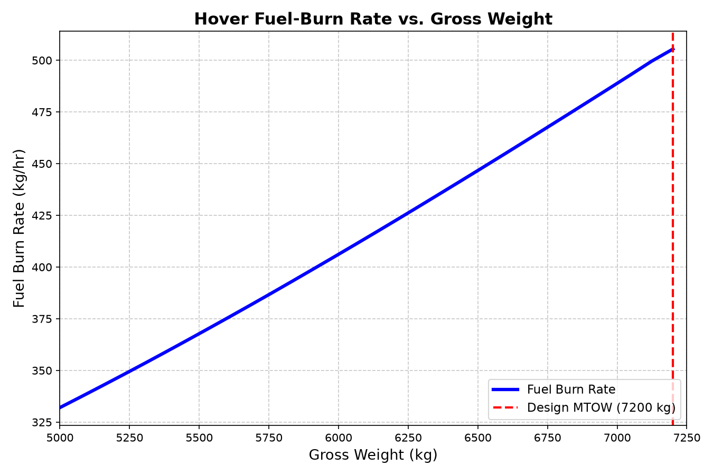

# Hover Fuel-Burn Analysis

### Flight Conditions
* **Environment:** Sea Level (ISA)
* **Rotor State:** Hovering at 550 RPM

### Observed Trend & Aerodynamic Physics
The plot demonstrates that as the aircraft's gross weight increases, the fuel burn rate increases non-linearly (curving upward). 

This behavior is governed by **Actuator Disk Momentum Theory**:
1. To maintain a steady hover, the rotors must produce a total thrust ($T$) exactly equal to the aircraft's gross weight ($W$).
2. The **induced power** ($P_i$) required to accelerate air downward and generate that thrust is defined as:
   $$P_i = \frac{T^{3/2}}{\sqrt{2 \rho A}}$$
3. Substituting thrust for weight ($T = W$), we see that required aerodynamic power scales with **weight to the power of 1.5** ($W^{3/2}$).

Because the turboshaft engine's fuel burn rate is directly proportional to the power it outputs, the fuel consumption also scales with $W^{3/2}$. Consequently, a 10% increase in aircraft weight requires roughly **15% more fuel**. This physical scaling law is exactly what creates the upward curve as the aircraft approaches its 7,200 kg Maximum Takeoff Weight (MTOW).

### Note on Units (kg/hr vs. kg/sec)
While the underlying BEMT physics simulation calculates mass flow rates in `kg/sec` (standard SI units for Watts and Joules), the final results are plotted in `kg/hr` for two primary reasons:
* **Human Readability:** A burn rate of `0.14 kg/sec` results in tiny, unintuitive decimals. Converting it yields `~500 kg/hr`, which is a highly readable and intuitive metric.
* **Aviation Standard:** Flight planning and endurance are practically measured in hours. Providing fuel flow in `kg/hr` allows engineers, mission planners, and pilots to mentally calculate endurance instantly (e.g., 1000 kg of fuel at 500 kg/hr = exactly 2 hours of flight time).

### Reserve Policy Impact
The aircraft is mandated to carry a **150 kg fuel reserve**. Based on the calculated burn rate at the maximum 7,200 kg MTOW, this reserve capacity provides exactly **17.8 minutes** of emergency hover endurance before total fuel exhaustion.
