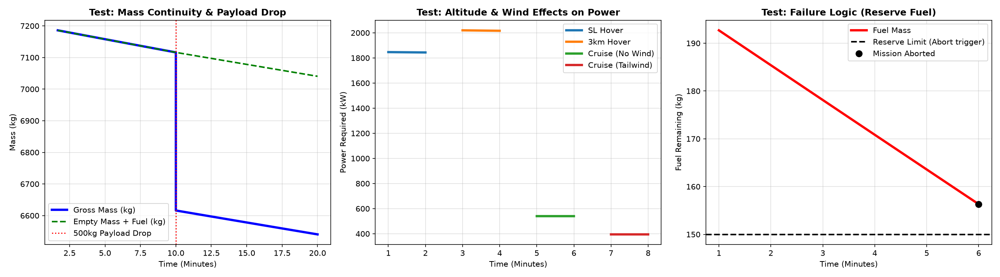
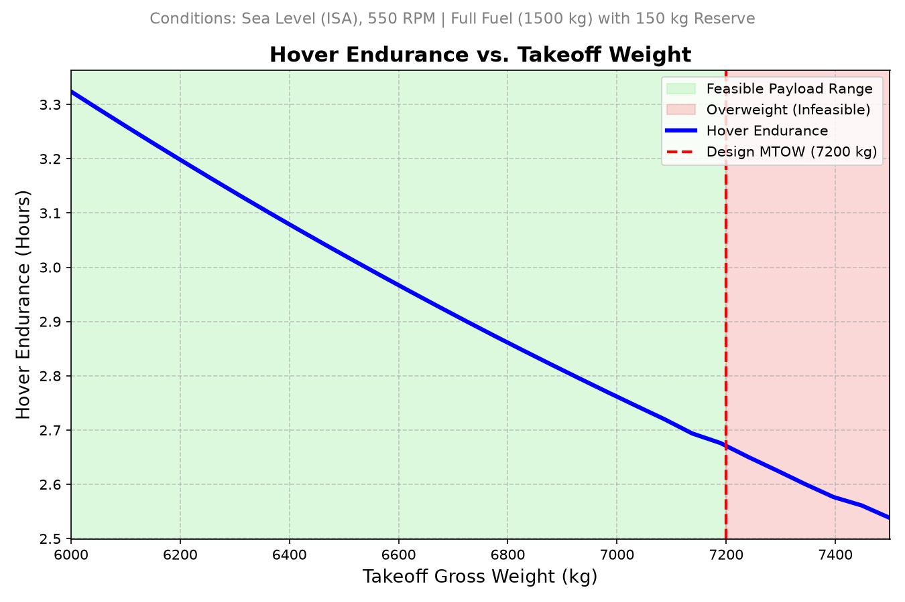
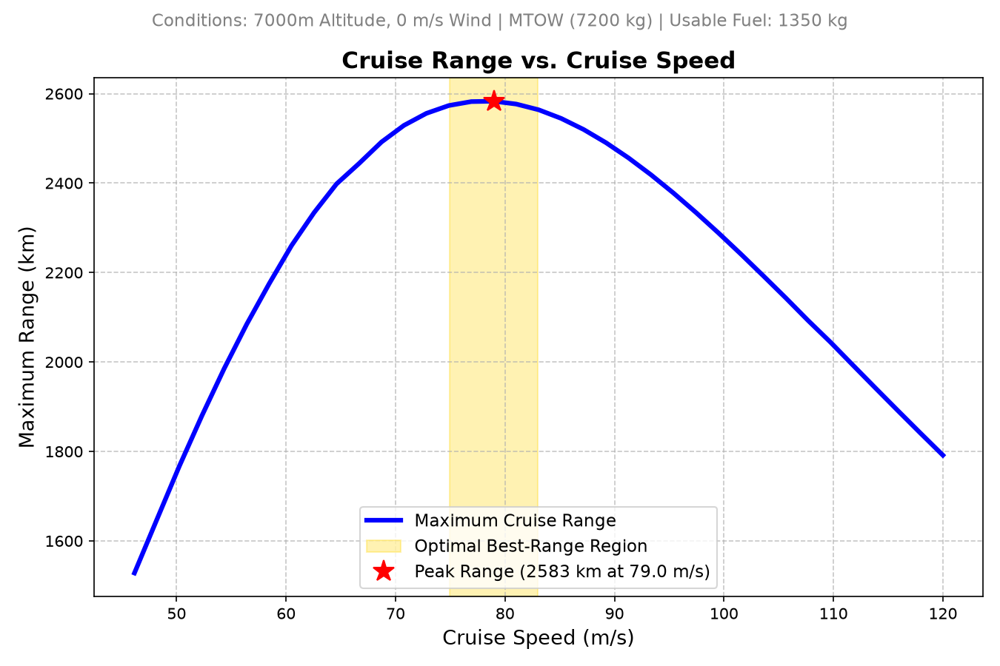

# Section 7: Mission Planner Verification and Overall Evaluation

## 7.1 Mission Planner Implementation & Verification
To ensure robust mission profiling, a dedicated Mission Planner was implemented and rigorously evaluated through isolated unit tests. 

The logic was verified against the following checklist requirements:
* **Mass Continuity & Fuel Update:** Total gross mass decreases accurately as fuel is consumed during segments.
* **Payload Pickup/Drop:** Discrete `PAYLOAD_EVENT` segments instantly adjust the gross mass while preserving continuous fuel mass tracking (visualized in the Mass Continuity plot).
* **Atmospheric Variation:** Hover power correctly scales with altitude (e.g., hovering at 3,000m accurately reflects higher power demands due to lower air density).
* **Wind Treatment:** Cruise segments actively subtract tailwinds (or add headwinds) to the effective axial velocity, drastically altering the calculated drag and power required.
* **Failure-Warning Logic (Reserve Fuel):** If fuel mass crosses the 150 kg reserve threshold, a `MissionInfeasibleError` is aggressively thrown to abort the mission.
* **Power Required/Available:** Exceeding aerodynamic limits or engine power margins (e.g., attempting to hover at 16,000m) successfully throws constraint violations.
* **Segment Sequencing & Feasible/Infeasible Testing:** A master test script successfully runs a Takeoff $\rightarrow$ Climb $\rightarrow$ Cruise sequence without violation, proving the continuous chaining of states.

---

## 7.2 Hover Fuel-Burn Rate vs. Gross Weight

**Conditions:** Sea Level (ISA), Hovering at 550 RPM

**Trend Explanation & Interpretation:**
* The plotted trend clearly demonstrates that hover fuel consumption increases continuously as the aircraft's gross weight increases.
* The relationship is strictly non-linear, curving upward at a progressively steeper rate at higher operating weights.
* This behavior is driven by fundamental hover physics, where the rotors must generate aerodynamic thrust exactly equal to the total aircraft weight ($T = W$).
* According to Actuator Disk Momentum Theory, the induced power required to generate this thrust scales with the thrust to the power of 1.5 ($T^{3/2}$).
* Consequently, the total aerodynamic power required from the engines scales directly with the aircraft weight to the power of 1.5 ($W^{3/2}$).
* Because the turboshaft engine's fuel consumption is directly proportional to its power output, the fuel burn rate strictly mirrors this $W^{3/2}$ scaling law.
* This mathematical relationship imposes a compounding weight penalty; for example, a 10% increase in aircraft weight requires roughly 15% more fuel to maintain a steady hover.
* As the aircraft approaches its 7,200 kg Maximum Takeoff Weight (MTOW), the slope of the curve is at its steepest, making hovering operations highly fuel-intensive.
* The steepness of this power-to-weight curve highlights the critical operational importance of strict payload mass management prior to takeoff.
* **Reserve Policy Impact:** At the hard 7,200 kg MTOW limit, this high fuel burn rate mathematically restricts the mandatory 150 kg fuel reserve to exactly **17.8 minutes** of emergency endurance.

---

## 7.3 Hover Endurance vs. Takeoff Weight

**Conditions:** Sea Level (ISA), 550 RPM | Full Fuel (1500 kg) with 150 kg Reserve

**Trend Explanation & Interpretation:**
* **Inverse Relationship:** As takeoff gross weight increases (loading more payload/cargo), the maximum hover endurance strictly decreases. 
* **Endurance Range:** At the absolute lightest takeoff weight (0 payload, 100% fuel), the aircraft boasts a maximum hover endurance of roughly **3.3 hours**. However, when fully loaded to the 7,200 kg MTOW limit, endurance significantly drops to roughly **2.67 hours**.
* **Aerodynamic Driver:** This downward trend is a direct result of the $W^{3/2}$ scaling law in Momentum Theory. Because a heavier aircraft requires disproportionately higher aerodynamic power to sustain a hover, the turboshaft engines must drastically increase their fuel burn rate, rapidly draining the fixed 1,350 kg usable fuel capacity.
* **Safety & Reserve Limits:** The calculation respects a strict 150 kg fuel reserve. Because the fuel burn rate is highest at the 7,200 kg MTOW limit, reaching the MTOW represents the most critical constraint on flight time, heavily restricting total operational endurance.

---

## 7.4 Cruise Range vs. Cruise Speed

**Conditions:** 7000m Altitude, 0 m/s Wind | MTOW (7200 kg) | Usable Fuel: 1350 kg

**Trend Explanation & Interpretation:**
* **The Inverted-Bowl Trend:** The cruise range curve forms a distinct inverted-bowl shape because it is inversely proportional to the aircraft's total aerodynamic drag in forward flight. Range is maximized exactly where the total drag is minimized.
* **Low-Speed Penalty (Left Side):** At slower cruise speeds (e.g., 40-50 m/s), the aircraft must fly at a very high angle of attack to generate enough lift to counteract the 7,200 kg MTOW. This creates massive **induced drag**. The high engine power required to overcome this induced drag burns fuel rapidly, resulting in poor range.
* **High-Speed Penalty (Right Side):** As the aircraft accelerates past 90 m/s, induced drag falls, but **parasite drag** (the air resistance against the fuselage, wings, and rotor nacelles) grows exponentially with the square of the velocity ($V^2$). Fighting this extreme parasite drag requires massive engine power, causing the fuel burn rate to spike and the maximum range to plummet.
* **The "Best Range" Region (The Peak):** The highlighted gold region represents the absolute aerodynamic sweet spot—the maximum Lift-to-Drag ($L/D$) ratio. At approximately **79 m/s**, the combined penalty of induced drag and parasite drag is at its absolute lowest point, allowing the aircraft to extract the maximum possible distance (**2,583 km**) from its 1,350 kg of usable fuel.

---

## 7.5 Overall Design Observations and Milestone 2 Needs

### Main Design Observations
* **The Hover-Cruise Compromise:** The tiltrotor achieves a highly optimal 85.2% propulsive efficiency in forward cruise by utilizing a steep 25° blade twist. However, this aggressive twist severely penalizes hover efficiency.
* **Weight Penalties:** Operating near the 7,200 kg MTOW requires disproportionately high engine power due to $W^{3/2}$ scaling laws, making the aircraft highly inefficient when hovering fully loaded.
* **Aerodynamic Sweet Spot:** Forward flight yields excellent range, with a distinct maximum lift-to-drag aerodynamic "bucket" peaking at exactly 79 m/s.

### Dominant Limitations
* **Hover Endurance Constraint:** Because fuel burn scales non-linearly with weight, max-payload hover endurance is severely restricted (only ~2.67 hours at MTOW).
* **Steady-State Isolation:** The current performance data only reflects isolated, steady-state axial conditions. It currently lacks the complex aerodynamic interference data from transient flight phases. 
* **Sensitivity to Key Assumptions:** The impressive 2,583 km peak cruise range is highly sensitive to our initial parasitic drag and engine Specific Fuel Consumption (SFC) assumptions. 

### Milestone 2 Requirements / Next Steps
* **Transition Corridor Modeling:** We must model the complex aerodynamic transition phase (nacelle tilt scheduling) to evaluate power required between hover and airplane mode.
* **Helicopter-Mode Edgewise Flight:** We must analyze forward flight *without* tilting the nacelles, accounting for advancing/retreating blade lift asymmetries and drag penalties.
* **Descent & Vortex Ring State (VRS):** Vertical landing profiles must be modeled to identify descent rate limits and ensure the rotors avoid hazardous Vortex Ring State boundaries.
* **Empennage Sizing & Moment Countering:** Current power estimates ignore aircraft trim moments. Milestone 2 will introduce the empennage to model pitch/yaw stability and active moment countering.
* **Rotor Flapping & Aeroelasticity:** We must introduce dynamic blade flapping models to analyze the structural loads and vibrations induced during transition and edgewise flight.
